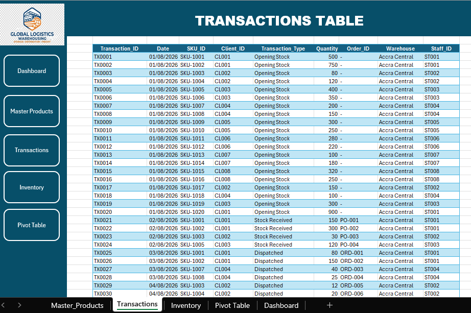
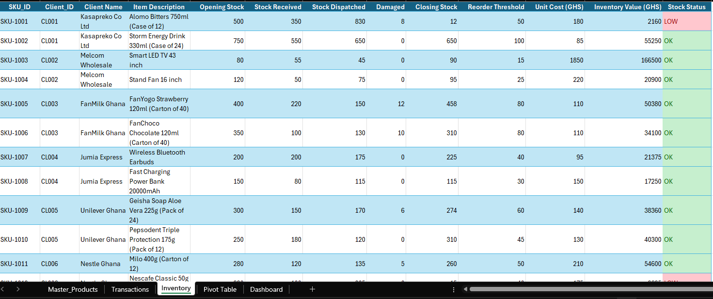
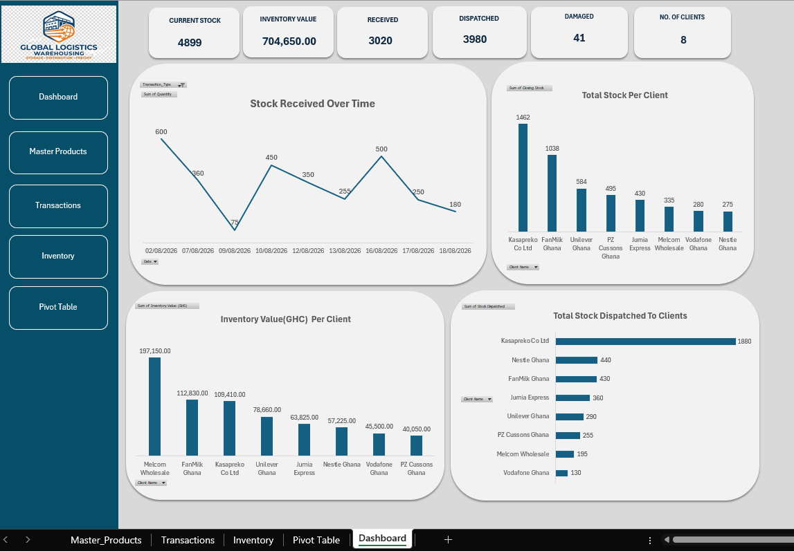

# 📦 Warehouse Inventory Tracking & Operations Dashboard

## 📌 Project Overview

An automated **Excel-based warehouse inventory management system** designed to help B2B warehouses track stock movement, monitor inventory levels, and identify products that require replenishment.

The project connects **Products, Transactions, and Inventory** data and presents key operational insights through an interactive dashboard.

## 🎯 Objectives

- Track stock received, dispatched, and damaged
- Automatically calculate closing stock
- Monitor inventory value
- Identify products below their reorder threshold
- Analyze inventory by client and storage zone
- Provide a clear dashboard for warehouse operations

## 🗂️ Workbook Structure

### 1. Products

The Products table serves as the master product database, containing SKU information, client details, storage zones, reorder thresholds, and unit costs.

### 2. Transactions

The Transactions table records daily warehouse activities, including stock received, dispatched, and damaged items for each SKU.

### 3. Inventory Tracker

The Inventory Tracker automatically calculates stock levels using transaction data. It tracks opening stock, receipts, dispatches, damages, closing stock, inventory value, and reorder status.

Products are flagged for **REORDER** when closing stock falls below the defined reorder threshold.

### 4. Dashboard

The interactive dashboard provides a high-level overview of warehouse operations, including current stock, inventory value, stock movement, client inventory, storage zones, and reorder alerts.

## 🧮 Key Calculations

### Closing Stock
Calculates the remaining inventory after accounting for all stock movements.

**Closing Stock = Opening Stock + Stock Received - Stock Dispatched - Damaged**

### Inventory Value
Calculates the total value of the stock currently held.

**Inventory Value = Closing Stock × Unit Cost**

### Reorder Status
Identifies products that need replenishment based on their current stock level.

**If Closing Stock ≤ Reorder Threshold → REORDER**  
**Otherwise → OK**
