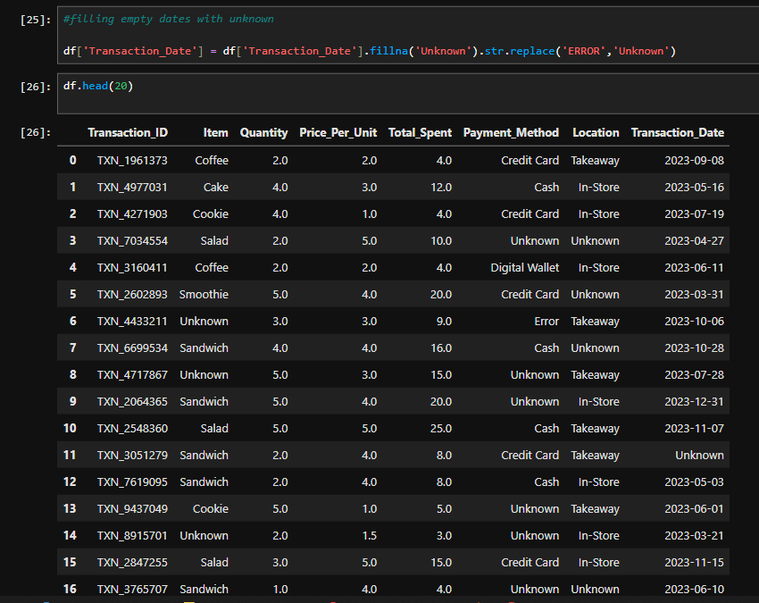

# 📊 Telco Customer Churn Prediction

An end-to-end Machine Learning project that predicts customer churn using a telecommunications customer dataset. This project demonstrates a complete machine learning workflow—from data preprocessing and feature engineering to model training, evaluation, and comparison of multiple classification algorithms.

---

## 📌 Project Overview

Customer churn is one of the most important business metrics in the telecommunications industry. Acquiring new customers is significantly more expensive than retaining existing ones, making churn prediction a valuable business problem.

The objective of this project is to develop predictive models that identify customers who are likely to discontinue their services. These predictions enable businesses to implement targeted retention strategies, reduce customer loss, and improve long-term revenue.

> **Business Goal:** Predict customer churn and identify high-risk customers before they leave.

